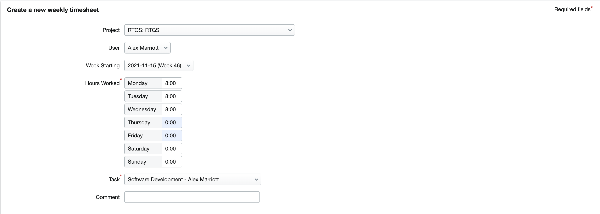
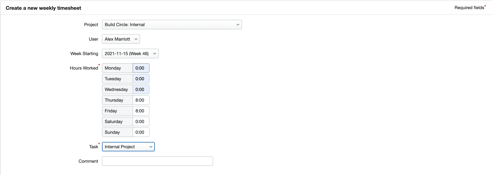

# Build Circle Onboarding

## Workstation setup

We have setup guides for installing recommended software you will likely need going into a project. Guides for [MacOS](https://github.com/BuildCircle/onboarding/blob/master/workstation/mac.md), [Windows](https://github.com/BuildCircle/onboarding/blob/master/workstation/windows10.md) & [Ubuntu](https://github.com/BuildCircle/onboarding/blob/master/workstation/ubuntu.md) are currently available.

## Ceremonies
### Show and Tell
Every two weeks Build Circle has a show and tell, where anyone can show off something they’ve been working on. This is a great chance to catch up with the rest of the team and see the challenges/learnings people have encountered.

Please remember that you don’t need to be the best developer with perfect code to take part in show and tell! Whatever you’ve been working on, sharing your work is a great way to get stuck in and share your progress with the team.

### 1 to 1s
Every two weeks you will have a 1 to 1 with Chris. This is a casual chat where you will have the chance to discuss your progress, ask questions, outline concerns, or just about anything else that you’d like to talk about. Of course if you have any burning questions, you don’t have to wait until the 1 to 1 to contact Chris!

## Project time tracking
By now you should have been sent a link to join FreeAgent. FreeAgent is where we handle any and all admin at Build Circle, and where you will be able to fill out your timesheet. By the end of the month, it’s important to ensure every working day is accounted for, so it’s a good habit to complete your timesheet every Friday so you don’t forget.

To fill in your timesheet, go to FreeAgent and navigate to Work > Time Tracking > Add weekly timesheet. Each day worked should be filled in as 8 hours, and you will need to fill in a separate timesheet for each different organisation worked for. The images below show an example where you’ve worked at RTGS Monday-Wednesday, and self-learning at Build Circle Thursday-Friday.

## Booking time off

You are entitled to 28 days of holiday per year (Jan 1 - Dec 31), plus bank holidays. Before booking a holiday in the system, check in with Chris to make sure that you’re not needed on those days (book in early to be safe!). 

Once this is confirmed, book in holiday with the [calendar linked here](https://calendar.google.com/calendar/u/0?cid=Y19jbG9pa2o2NTNiNnFtN3FhNWsxc3Ntb2ZhMEBncm91cC5jYWxlbmRhci5nb29nbGUuY29t). Your holiday days will also need to be added to your timesheet, in the same format as you filled in the timesheet above - selecting the project as Build Circle Internal, and the task as Holiday. Make sure to remind your team the week before you go away!

## Sick leave
In the unfortunate circumstances that you’re sick, make sure to inform Chris as soon as you can. Any sick days will again need to be added to the timesheet, selecting the project as Build Circle Internal, and the task as Sickness.

## Benefits & Pearks
You can about these [here](https://github.com/BuildCircle/onboarding/blob/main/benefits-and-perks.md)
